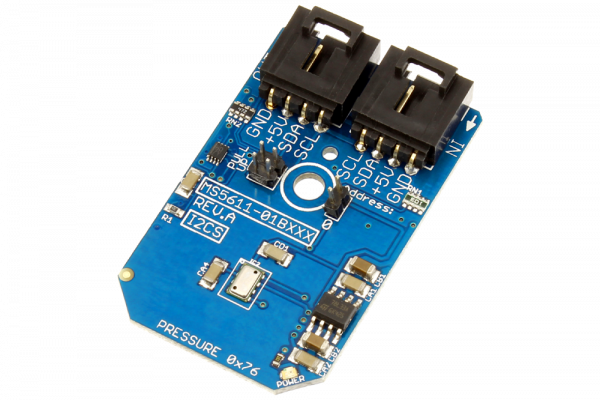

# MS5611-01BA01

From MEAS Switzerland, the MS5611-01BA is a new generation of high resolution altimeter sensors with an I2C bus interface.
This Device is available from www.ncd.io 

[SKU: MS5611-01BA01_I2CS]

(https://store.ncd.io/product/ms5611-01ba01-variometer-with-24-bit-analog-to-digital-converter-i2c-mini-module/)
This Sample code can be used with Arduino.

Hardware needed to interface MS5611-01BA01 sensor with Arduino

1. <a href="https://store.ncd.io/product/i2c-shield-for-arduino-nano/">Arduino Nano</a>

2. <a href="https://store.ncd.io/product/i2c-shield-for-arduino-micro-with-i2c-expansion-port/">Arduino Micro</a>

3. <a href="https://store.ncd.io/product/i2c-shield-for-arduino-uno/">Arduino uno</a>

4. <a href="https://store.ncd.io/product/dual-i2c-shield-for-arduino-due-with-modular-communications-interface/">Arduino Due</a>

5. <a href="https://store.ncd.io/product/ms5611-01ba01-variometer-with-24-bit-analog-to-digital-converter-i2c-mini-module/">MS5611-01BA01 24Bit Variometer ADC</a>

6. <a href="https://store.ncd.io/product/i%C2%B2c-cable/">I2C Cable</a>

MS5611-01BA01:

From MEAS Switzerland, the MS5611-01BA is a new generation of high resolution altimeter sensors with an I2C bus interface.

Applications:

• Indoor navigation,bike computers,mobile altimeter / barometer systems and variometers.

How to Use the MS5611-01BA01 Arduino Library

The MS5611-01BA01 has a number of settings, which can be configured based on user requirements.
          
1.Address calling:The following command is used to call the MS5611-01BA01 to begin the transmission.

            ms.getAddr_MS5611_01BXXX(MS5611_01BXXX_ADDRESS_LOW); 
            
2.Initial Pressure setting:The following command is used to set the initial pressure.

            ms.setinitiatePressure(D1_OSR_256);           // Convert D1 (OSR=256)
             
3.Initial Temperature setting:The following command is used to set the initial temperature of MS5611-01BA01 sensor.             
             
            ms.setinitiateTemperature(D2_OSR_256);        // Convert D2 (OSR=256)
